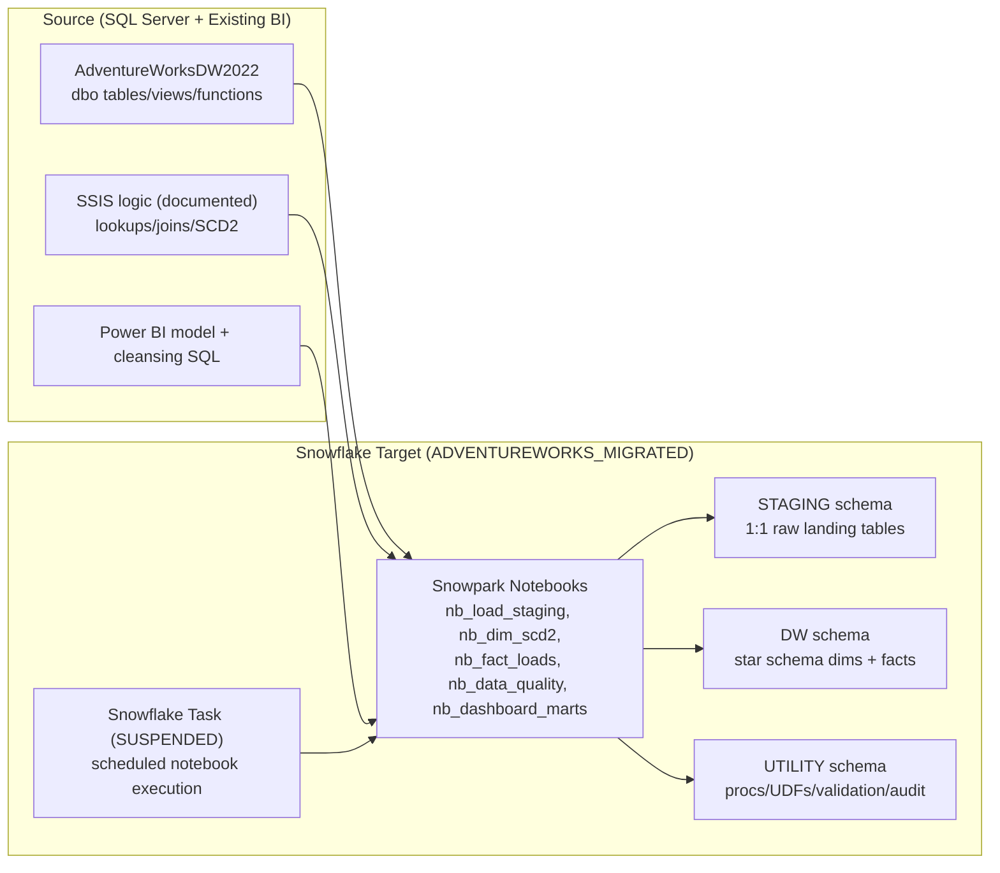
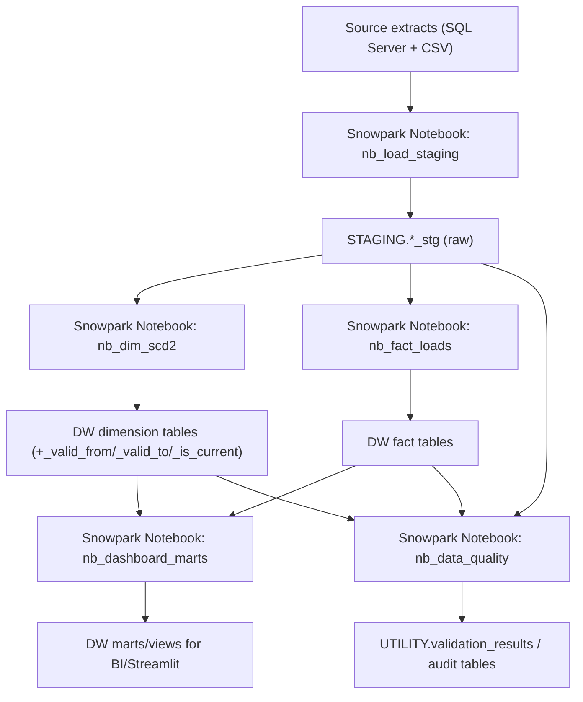

# 02-target-architecture

## 1) Scope and design constraints

- Source baseline: `01-assessment-report.md` (48 required migration objects + supplemental analytical objects).
- Target primitive constraint: **Snowpark Notebooks only** for transformation/orchestration logic.
- Migration scope: **full historical data** from `AdventureWorksDW2022`.
- Target database: `ADVENTUREWORKS_MIGRATED`.

## 2) Source vs target architecture diagram



## 3) Target schema layout

| Schema | Purpose | Primary object classes | Write path |
|---|---|---|---|
| `STAGING` | Raw landed data with source-compatible structure | Staging tables (`*_stg`) | `nb_load_staging` |
| `DW` | Curated dimensional model (star schema) | Dimension/fact tables, marts/views | `nb_dim_scd2`, `nb_fact_loads`, `nb_dashboard_marts` |
| `UTILITY` | Operational support layer | Notebook wrapper procs, UDFs, validation/audit tables, task metadata | `nb_data_quality`, `nb_dashboard_marts` |

### SCD Type 2 standard (all DW dimension tables)

All `DW` dimension tables include:

- `_valid_from TIMESTAMP_NTZ`
- `_valid_to TIMESTAMP_NTZ`
- `_is_current BOOLEAN`

## 4) SQL Server → Snowflake data type mapping (AdventureWorksDW2022)

| SQL Server type | Snowflake type | Mapping rule / note |
|---|---|---|
| `bit` | `BOOLEAN` | Direct boolean mapping |
| `tinyint` | `NUMBER(3,0)` | Preserves unsigned 0–255 range |
| `smallint` | `NUMBER(5,0)` | Integer mapping |
| `int` | `NUMBER(10,0)` | Integer mapping |
| `real` | `FLOAT` | Single precision becomes Snowflake float |
| `float` | `FLOAT` | Direct floating-point mapping |
| `money` | `NUMBER(19,4)` | Preserve 4-decimal currency precision |
| `char(n)` | `CHAR(n)` | Fixed-width string |
| `nchar(n)` | `NCHAR(n)` | Unicode fixed-width string |
| `varchar(n)` | `VARCHAR(n)` | Variable-width string |
| `nvarchar(n)` | `VARCHAR(n)` | Snowflake `VARCHAR` is Unicode |
| `sysname` | `VARCHAR(128)` | SQL Server alias type |
| `date` | `DATE` | Direct date mapping |
| `datetime` | `TIMESTAMP_NTZ` | TZ-less timestamp for warehouse consistency |
| `varbinary(n/max)` | `BINARY` | Binary payload preserved |
| `xml` | `VARIANT` | Loaded as semi-structured document |

## 5) Source-to-target object mapping

### 5.1 Source table mapping (all inventoried source tables)

| Source object | STAGING target | DW/UTILITY target | Snowpark notebook primitive | Notes |
|---|---|---|---|---|
| `dbo.AdventureWorksDWBuildVersion` | `STAGING.adventureworks_dw_build_version_stg` | `UTILITY.source_build_version_audit` | `nb_load_staging`, `nb_data_quality` | Source version/audit lineage |
| `dbo.DatabaseLog` | `STAGING.database_log_stg` | `UTILITY.source_database_log_audit` | `nb_load_staging`, `nb_data_quality` | Operational lineage/history |
| `dbo.DimAccount` | `STAGING.dim_account_stg` | `DW.dim_account` | `nb_load_staging`, `nb_dim_scd2` | SCD2 columns applied |
| `dbo.DimCurrency` | `STAGING.dim_currency_stg` | `DW.dim_currency` | `nb_load_staging`, `nb_dim_scd2` | SCD2 columns applied |
| `dbo.DimCustomer` | `STAGING.dim_customer_stg` | `DW.dim_customer` | `nb_load_staging`, `nb_dim_scd2` | SCD2 columns applied |
| `dbo.DimDate` | `STAGING.dim_date_stg` | `DW.dim_date` | `nb_load_staging`, `nb_dim_scd2` | SCD2 columns applied |
| `dbo.DimDepartmentGroup` | `STAGING.dim_department_group_stg` | `DW.dim_department_group` | `nb_load_staging`, `nb_dim_scd2` | SCD2 columns applied |
| `dbo.DimEmployee` | `STAGING.dim_employee_stg` | `DW.dim_employee` | `nb_load_staging`, `nb_dim_scd2` | SCD2 columns applied |
| `dbo.DimGeography` | `STAGING.dim_geography_stg` | `DW.dim_geography` | `nb_load_staging`, `nb_dim_scd2` | SCD2 columns applied |
| `dbo.DimOrganization` | `STAGING.dim_organization_stg` | `DW.dim_organization` | `nb_load_staging`, `nb_dim_scd2` | SCD2 columns applied |
| `dbo.DimProduct` | `STAGING.dim_product_stg` | `DW.dim_product` | `nb_load_staging`, `nb_dim_scd2` | SCD2 columns applied |
| `dbo.DimProductCategory` | `STAGING.dim_product_category_stg` | `DW.dim_product_category` | `nb_load_staging`, `nb_dim_scd2` | SCD2 columns applied |
| `dbo.DimProductSubcategory` | `STAGING.dim_product_subcategory_stg` | `DW.dim_product_subcategory` | `nb_load_staging`, `nb_dim_scd2` | SCD2 columns applied |
| `dbo.DimPromotion` | `STAGING.dim_promotion_stg` | `DW.dim_promotion` | `nb_load_staging`, `nb_dim_scd2` | SCD2 columns applied |
| `dbo.DimReseller` | `STAGING.dim_reseller_stg` | `DW.dim_reseller` | `nb_load_staging`, `nb_dim_scd2` | SCD2 columns applied |
| `dbo.DimSalesReason` | `STAGING.dim_sales_reason_stg` | `DW.dim_sales_reason` | `nb_load_staging`, `nb_dim_scd2` | SCD2 columns applied |
| `dbo.DimSalesTerritory` | `STAGING.dim_sales_territory_stg` | `DW.dim_sales_territory` | `nb_load_staging`, `nb_dim_scd2` | SCD2 columns applied |
| `dbo.DimScenario` | `STAGING.dim_scenario_stg` | `DW.dim_scenario` | `nb_load_staging`, `nb_dim_scd2` | SCD2 columns applied |
| `dbo.FactAdditionalInternationalProductDescription` | `STAGING.fact_additional_international_product_description_stg` | `DW.fact_additional_international_product_description` | `nb_load_staging`, `nb_fact_loads` | Fact/bridge load |
| `dbo.FactCallCenter` | `STAGING.fact_call_center_stg` | `DW.fact_call_center` | `nb_load_staging`, `nb_fact_loads` | Fact load |
| `dbo.FactCurrencyRate` | `STAGING.fact_currency_rate_stg` | `DW.fact_currency_rate` | `nb_load_staging`, `nb_fact_loads` | Fact load |
| `dbo.FactFinance` | `STAGING.fact_finance_stg` | `DW.fact_finance` | `nb_load_staging`, `nb_fact_loads` | Fact load |
| `dbo.FactInternetSales` | `STAGING.fact_internet_sales_stg` | `DW.fact_internet_sales` | `nb_load_staging`, `nb_fact_loads` | Fact load |
| `dbo.FactInternetSalesReason` | `STAGING.fact_internet_sales_reason_stg` | `DW.fact_internet_sales_reason` | `nb_load_staging`, `nb_fact_loads` | Bridge/fact load |
| `dbo.FactProductInventory` | `STAGING.fact_product_inventory_stg` | `DW.fact_product_inventory` | `nb_load_staging`, `nb_fact_loads` | High-volume fact load |
| `dbo.FactResellerSales` | `STAGING.fact_reseller_sales_stg` | `DW.fact_reseller_sales` | `nb_load_staging`, `nb_fact_loads` | Fact load |
| `dbo.FactSalesQuota` | `STAGING.fact_sales_quota_stg` | `DW.fact_sales_quota` | `nb_load_staging`, `nb_fact_loads` | Fact load |
| `dbo.FactSurveyResponse` | `STAGING.fact_survey_response_stg` | `DW.fact_survey_response` | `nb_load_staging`, `nb_fact_loads` | Fact load |
| `dbo.NewFactCurrencyRate` | `STAGING.new_fact_currency_rate_stg` | `DW.fact_currency_rate_incremental` | `nb_load_staging`, `nb_fact_loads` | Incremental/aux currency feed |
| `dbo.ProspectiveBuyer` | `STAGING.prospective_buyer_stg` | `DW.dim_prospective_buyer` | `nb_load_staging`, `nb_dim_scd2` | Dimension-style entity, SCD2 columns applied |
| `dbo.sysdiagrams` | `STAGING.sysdiagrams_stg` | `UTILITY.source_diagram_metadata` | `nb_load_staging`, `nb_data_quality` | System metadata retained for completeness |

### 5.2 SSIS / SQL transformation and dashboard object mapping

| Source object | Source type | Target Snowflake object | Snowpark notebook primitive | Mapping intent |
|---|---|---|---|---|
| `SSIS::Customer OLE DB Source` | Transformation | `STAGING.dim_customer_stg` ingest step | `nb_load_staging` | Source extraction analogue |
| `SSIS::Customer-YearlyIncome Flat File Source` | Transformation | `STAGING.customer_yearly_income_stg` | `nb_load_staging` | Flat-file ingest into staging |
| `SSIS::Sort (Customer-YearlyIncome)` | Transformation | Sort step before joins | `nb_dim_scd2` | Deterministic merge ordering |
| `SSIS::Merge Join (Left Outer)` | Transformation | Customer enrichment transform | `nb_dim_scd2` | Left-join equivalent in Snowpark DataFrame |
| `SSIS::Lookup enrichment` | Transformation | Surrogate/key lookup stage | `nb_dim_scd2`, `nb_fact_loads` | Reference enrichment |
| `SSIS::Derived Column` | Transformation | Derived attribute projection | `nb_dim_scd2`, `nb_dashboard_marts` | Business rule derivations |
| `SSIS::Union All` | Transformation | Unioned conforming set | `nb_dim_scd2` | Stream recombination |
| `SSIS::SCD Type 2 load` | Transformation | `DW.dim_customer`, `DW.dim_product`, other dims | `nb_dim_scd2` | Historical merge with `_valid_*` fields |
| `SSIS::OLE DB Destination (DimCustomer)` | Transformation | `DW.dim_customer` target write | `nb_dim_scd2` | Final dimension sink |
| `SQL::DIM_Customer Cleansing` | Transformation | `DW.mart_dim_customer` | `nb_dashboard_marts` | Dashboard-serving customer mart |
| `SQL::DIM_Product Cleansing` | Transformation | `DW.mart_dim_product` | `nb_dashboard_marts` | Product mart with hierarchy attributes |
| `SQL::DIM_Calender Cleansing` | Transformation | `DW.mart_dim_calendar` | `nb_dashboard_marts` | Calendar mart (2019+) |
| `SQL::FACT_InternetSales filter` | Transformation | `DW.mart_fact_internet_sales` | `nb_dashboard_marts` | Filtered fact mart for analytics |
| `AdventureWorks Sales Performance Dashboard.pbix` | Dashboard | `DW.mart_sales_overview` and marts above | `nb_dashboard_marts` | Semantic model replacement foundation |
| `Power BI page: Sales Overview` | Dashboard | `DW.mart_sales_overview` | `nb_dashboard_marts` | KPI/trend ready model |
| `Power BI page: Product Details` | Dashboard | `DW.mart_product_details` | `nb_dashboard_marts` | Product-centric model |
| `Power BI page: Customer Details` | Dashboard | `DW.mart_customer_details` | `nb_dashboard_marts` | Customer-centric model |

### 5.3 Supplemental analytical object mapping (views/functions from assessment)

| Source object | Source type | Target Snowflake object | Snowpark notebook primitive | Notes |
|---|---|---|---|---|
| `dbo.vAssocSeqLineItems` | View | `DW.v_assoc_seq_line_items` | `nb_dashboard_marts` | Recreated as Snowflake view |
| `dbo.vAssocSeqOrders` | View | `DW.v_assoc_seq_orders` | `nb_dashboard_marts` | Recreated as Snowflake view |
| `dbo.vDMPrep` | View | `DW.v_dm_prep` | `nb_dashboard_marts` | Recreated as Snowflake view |
| `dbo.vTargetMail` | View | `DW.v_target_mail` | `nb_dashboard_marts` | Recreated as Snowflake view |
| `dbo.vTimeSeries` | View | `DW.v_time_series` | `nb_dashboard_marts` | Recreated as Snowflake view |
| `dbo.udfBuildISO8601Date` | Function | `UTILITY.udf_build_iso8601_date` | `nb_dashboard_marts` | Notebook-managed SQL UDF deployment |
| `dbo.udfMinimumDate` | Function | `UTILITY.udf_minimum_date` | `nb_dashboard_marts` | Notebook-managed SQL UDF deployment |
| `dbo.udfTwoDigitZeroFill` | Function | `UTILITY.udf_two_digit_zero_fill` | `nb_dashboard_marts` | Notebook-managed SQL UDF deployment |

## 6) Data flow diagram (staging → DW)



## 7) Scheduled Snowpark notebook design (Snowflake Task)

### 7.1 Design

| Item | Value |
|---|---|
| Scheduled notebook | `UTILITY.nb_data_quality` |
| Purpose | Daily row-count/null/duplicate/SCD integrity checks |
| Trigger mechanism | Snowflake `TASK` calling notebook wrapper proc |
| Cron expression | `USING CRON 0 2 * * * UTC` (daily 02:00 UTC) |
| Initial task state | `SUSPENDED` (explicitly left suspended) |
| Warehouse | `COMPUTE_WH` (configurable) |

### 7.2 Task DDL pattern

```sql
CREATE OR REPLACE TASK ADVENTUREWORKS_MIGRATED.UTILITY.task_run_nb_data_quality_daily
  WAREHOUSE = COMPUTE_WH
  SCHEDULE = 'USING CRON 0 2 * * * UTC'
  COMMENT = 'Runs Snowpark notebook data quality checks'
AS
  CALL ADVENTUREWORKS_MIGRATED.UTILITY.sp_run_nb_data_quality();

ALTER TASK ADVENTUREWORKS_MIGRATED.UTILITY.task_run_nb_data_quality_daily SUSPEND;
```

`sp_run_nb_data_quality` is a thin wrapper that executes the Snowpark notebook `UTILITY.nb_data_quality` and writes status metrics to `UTILITY.validation_results`.

## 8) Implementation notes carried to next phases

- DDL generation must create all three schemas and include SCD2 columns on every `DW.dim_*` table.
- Notebook generation must preserve notebook names used in this mapping to keep task and flow references stable.
- Data migration scripts should load full history into `STAGING` first, then apply notebook-driven SCD2/fact processing into `DW`.
