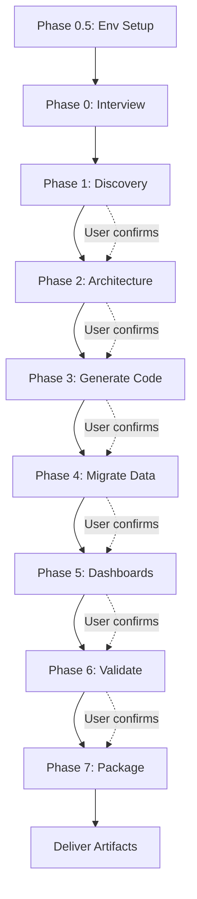

# Mission Specification: Automated Migration from AdventureWorks/SQL Server to Snowflake

## 0. Execution Model: Two-Part Approach

This work is split into **two separate Droid sessions**:

- **Part 1 — Environment Setup (Standalone Droid Session):** Runs interactively to prepare the laptop/demo machine. Installs tools, starts Docker with SQL Server + AdventureWorks, clones repos, tests connectivity, and leaves the environment ready. This is done once per demo machine and does not need to be repeated.
- **Part 2 — Migration Mission (Factory Mission):** The actual repeatable mission that performs discovery, architecture design, code generation, data migration, dashboard migration, validation, and packaging. This mission assumes Part 1 is already complete and can be run multiple times (e.g., to show different primitive choices or source variants).

**Why this split?**
- Environment setup involves long-running operations (Docker image pulls, `.bak` downloads, ODBC driver installation) that are not suitable for a mission's fixed timeout.
- The migration mission should be fast and repeatable for demo purposes — you want to show it end-to-end in under 60 minutes.
- Separating setup from migration allows the partner to pre-stage the demo environment before the customer call.

---

## 1. Mission Overview (Part 2)

This mission automates the end-to-end migration of a publicly available, demo-grade Microsoft data warehouse stack (AdventureWorks OLTP + SSIS ETL + Power BI/Tableau dashboards) into Snowflake. The mission includes data pipeline migration, data validation, and dashboard migration (repointing or refactoring to Streamlit). The output is a complete, documented, and validated set of Snowflake artifacts that a partner can review, deploy, and demo to their customers.

**Target audience:** A partner who performs frequent migrations to Snowflake and wants to understand how Factory Droid can accelerate and standardize this work.

**Prerequisite:** Part 1 (Environment Setup) must be completed first. The mission expects AdventureWorks to be running in Docker on `localhost:1433` and source repositories to be cloned locally.

---

## 2. Mission Inputs

| Input | Description | Default |
|-------|-------------|---------|
| `source_repo_url` | GitHub URL of the AdventureWorks + SSIS project to migrate | `https://github.com/andrescastillol/ETL-DesignSolution` |
| `dashboard_repo_url` | GitHub URL of a dashboard project (Power BI or Tableau) | User selects from discovered options |
| `target_snowflake_account` | Optional — Snowflake account URL for live deployment | `null` (generate files only if not provided) |
| `target_database` | Snowflake database name for migrated objects | `ADVENTUREWORKS_MIGRATED` |
| `target_schema` | Snowflake schema name | `DW` |
| `migration_strategy` | `code_only`, `subset_data`, `full_data`, `incremental` | `subset_data` |
| `dashboard_strategy` | `repoint`, `streamlit`, `both` | `both` |
| `target_primitives` | `dynamic_tables`, `snowpark_notebooks`, `tasks_streams`, `stored_procs`, `auto` | `auto` |

---

## 3. Mission Phases

### Phase 0: User Interview (Interactive)

Before any work begins, the mission asks the user:

1. **Which source system?**
   - Option A: `andrescastillol/ETL-DesignSolution` (AdventureWorks + SSIS, recommended)
   - Option B: `MJshah001/MSBI-Datawarehouse-ADW` (AdventureWorks + SSIS + SSAS + Power BI)
   - Option C: User provides a custom GitHub URL

2. **Which dashboard source?**
   - Option A: Power BI project (e.g., `RohanParkar/AdventureWorks-Sales-Performance-Dashboard`)
   - Option B: Tableau project (e.g., `ApoorvaArbooj/Tableau-AdventureWorks`)
   - Option C: Skip dashboard migration

3. **Target Snowflake primitives?**
   - Option A: Let Droid analyze source and recommend the best combination
   - Option B: Force Dynamic Tables + Snowpark Notebooks + Tasks
   - Option C: Force Stored Procedures + Tasks only
   - Option D: Force Snowpark Notebooks only

4. **Dashboard migration strategy?**
   - Option A: Repoint existing dashboard to Snowflake
   - Option B: Refactor to a new Streamlit app
   - Option C: Produce both with a comparison report

5. **Data migration scope?**
   - Option A: Code and pipelines only (no data movement)
   - Option B: Subset of data (e.g., last 2 years of sales)
   - Option C: Full historical data

6. **Operational constraint?**
   - Option A: Demo/POC — clean cutover acceptable
   - Option B: Production-like — zero-downtime, phased approach required

7. **Do you have a Snowflake account for live deployment?**
   - Option A: Yes — provide account URL, user, role, warehouse
   - Option B: No — generate files only, deployment is manual

---

## 8. Part 1 — Environment Setup (Standalone Droid Session)

> **This section describes a standalone, interactive Droid session that runs before the mission.** It is not part of the Factory Mission itself. Run this once per demo machine to prepare the environment.

### 8.1 Session Goal

Prepare the local machine so that the migration mission (Part 2) can run without any environment-related delays. This includes installing tools, starting Docker with SQL Server + AdventureWorks, cloning repositories, and verifying connectivity.

### 8.2 Session Tasks

1. **Check prerequisites and install if missing:**
   - `git` — for cloning repositories
   - `docker` and `docker-compose` — for running SQL Server locally
   - `python3` and `pip` — for running extraction scripts and Streamlit
   - `snowsql` or `snowflake-cli` — for deploying to Snowflake (if live deployment planned)
   - `snowflake-connector-python` — Python package for Snowflake connectivity
   - `pyodbc` + ODBC Driver for SQL Server — for extracting data from Docker SQL Server
   - `jupyter` — for running generated notebooks (optional but recommended)

2. **Provision Source SQL Server (Docker):**
   - Pull `mcr.microsoft.com/mssql/server:2022-latest` image.
   - Run container with environment variables:
     - `ACCEPT_EULA=Y`
     - `MSSQL_SA_PASSWORD=<strong_password>`
     - `MSSQL_PID=Developer`
   - Map host port `1433` to container port `1433`.
   - Mount a volume for AdventureWorks database files so data persists across restarts.
   - Wait for SQL Server to be healthy (probe via `sqlcmd` or `pyodbc` connection).
   - **Note for Apple Silicon (ARM64):** The `linux/amd64` SQL Server image will run under Rosetta emulation. Ensure Docker Desktop is configured to run x86/amd64 containers.

3. **Download and Restore AdventureWorks:**
   - Download `AdventureWorksDW2022.bak` (or compatible version) from Microsoft's official SQL Server samples releases.
   - Copy `.bak` file into the container's data directory.
   - Query logical file names via `RESTORE FILELISTONLY` to determine correct `MOVE` targets.
   - Execute `RESTORE DATABASE` T-SQL command via `sqlcmd` inside the container.
   - Verify restore succeeded: `SELECT COUNT(*) FROM AdventureWorksDW2022.dbo.DimCustomer` (or equivalent).

4. **Clone Source Repositories:**
   - Clone `source_repo_url` (default: `andrescastillol/ETL-DesignSolution`) into `source/etl-repo/`.
   - Clone dashboard repo (e.g., `RohanParkar/AdventureWorks-Sales-Performance-Dashboard`) into `source/dashboard-repo/`.
   - Verify repository contents match expected structure (`.dtsx`, `.sql`, `.pbix`, `.twbx` files).

5. **Validate Network Connectivity:**
   - Test connection from host to Docker SQL Server on `localhost:1433`.
   - If live Snowflake deployment planned: test connection to the partner's Snowflake account using provided credentials.
   - Document any firewall / VPN / whitelist issues.

6. **Create Output Workspace:**
   - Create directory structure: `output/phase{0..7}/`.
   - Initialize a Git repository in `output/` (optional, for tracking generated artifacts).

### 8.3 Session Output

- `00-environment-setup-log.md` — summary of installed tools, Docker status, connection test results, and any issues encountered.
- Running Docker container with SQL Server + AdventureWorksDW on `localhost:1433`.
- Cloned source repositories in `source/`.
- Verified connectivity to source DB and optionally target Snowflake account.

### 8.4 Time Estimate

- First run (with downloads): 15–25 minutes
- Subsequent runs (Docker already cached): 5–10 minutes

---

## 9. Part 2 — Migration Mission Phases

> **This section describes the Factory Mission that runs after Part 1 is complete.** The mission assumes the environment is ready and focuses purely on migration work.

---

### Phase 1: Source Discovery & Assessment

**Goal:** Understand exactly what is in the source repository and how complex the migration will be.

**Tasks:**
1. Parse the cloned repository structure and identify all artifact types:
   - T-SQL DDL scripts (`.sql`)
   - SSIS package files (`.dtsx`) — extract XML to understand control flow, data flow, transformations, sources, destinations
   - CSV / flat file references
   - Stored procedures, views, functions
   - Python notebooks (if any)
   - Dashboard files (`.pbix` for Power BI, `.twbx` for Tableau)
3. Build an **Object Inventory** — a structured list of every table, proc, SSIS package, transformation, and dashboard with metadata (name, type, estimated complexity, dependencies).
4. Run a **Complexity Scoring** heuristic:
   - Simple: Direct table-to-table loads, simple data types, no SCD
   - Medium: SCD Type 1, simple lookups, minor data type mismatches
   - Complex: SCD Type 2, custom transformations, scripting tasks, complex joins, Oracle-specific functions
5. Produce an **Assessment Report** (markdown) summarizing:
   - Total objects found
   - Complexity distribution
   - Recommended target primitives (if user selected "auto")
   - Known risk areas (e.g., functions with no direct Snowflake equivalent)
   - Recommended migration strategy based on source profile

**Output:** `01-assessment-report.md`

---

### Phase 2: Snowflake Target Architecture Design

**Goal:** Design the target Snowflake architecture based on the assessment and user preferences.

**Tasks:**
1. Map every source object to a target Snowflake primitive:
   - Tables → Tables (with appropriate file format, clustering keys)
   - SSIS Data Flows → Dynamic Tables or Tasks + Streams
   - SSIS Transformations → Snowpark Python Notebooks or Stored Procedures
   - SCD Type 2 Logic → Snowpark Notebook with MERGE + historical tracking
   - Scheduled Jobs → Snowflake Tasks with cron expressions
2. Design the **target schema layout**:
   - Staging schema: raw loaded data
   - DW schema: star schema dimensions and facts
   - Utility schema: stored procs, UDFs, validation tables
3. Define **data types mapping** (SQL Server → Snowflake):
   - `DATETIME` → `TIMESTAMP_NTZ`
   - `VARCHAR(n)` → `VARCHAR(n)`
   - `DECIMAL(p,s)` → `NUMBER(p,s)`
   - `BIT` → `BOOLEAN`
   - etc.
4. Produce a **Target Architecture Document** (markdown with diagrams):
   - Source vs Target architecture diagram
   - Object mapping table (source object → target object → primitive)
   - Data flow diagram showing how data moves from staging → DW

**Output:** `02-target-architecture.md`

---

### Phase 2.5: Data Migration Scripts Generation (If Data Scope Selected)

**Goal:** Generate scripts to extract data from the running Docker SQL Server and load it into Snowflake.

**Tasks:**
1. **Generate Data Extraction Script:**
   - Produce `extract_data.py` — Python script using `pyodbc` to connect to Docker SQL Server (`localhost:1433`).
   - Extract tables selected by the migration strategy (subset or full).
   - For subset strategy: apply filters (e.g., `WHERE OrderDate >= DATEADD(year, -2, GETDATE())`) to reduce data volume.
   - Write extracted data to Parquet or CSV files in `output/extracted-data/`.
   - Include progress logging and error handling.

2. **Generate Data Loading Scripts:**
   - Produce `load_staging.sql` — `COPY INTO` commands for loading extracted files into Snowflake staging tables.
   - Produce `load_dw.sql` — MERGE statements to populate DW tables from staging, handling SCD Type 2 logic.

3. **Optionally Execute:**
   - If the user confirms and Docker SQL Server is healthy: run `extract_data.py` to produce the files.
   - If a Snowflake account is configured: upload files to stage and execute loading scripts.

**Output:** `03-data-migration-scripts/` directory containing `extract_data.py`, `load_staging.sql`, `load_dw.sql`, and `extracted-data/` (if executed).

---

### Phase 3: Code Generation (Snowflake Artifacts)

**Goal:** Generate all Snowflake-deployable code artifacts.

**Tasks:**
1. **DDL Generation:**
   - Generate `01_create_databases.sql` — create target database, schemas, warehouses
   - Generate `02_create_staging_tables.sql` — raw staging tables
   - Generate `03_create_dw_tables.sql` — star schema dimensions and facts with SCD Type 2 support columns (`_valid_from`, `_valid_to`, `_is_current`)
   - Generate `04_create_file_formats.sql` — CSV, Parquet file formats
   - Generate `05_create_stages.sql` — internal/external stage definitions

2. **ETL Pipeline Generation:**
   - If Dynamic Tables selected:
     - Generate `dt_dimensions.sql` — Dynamic Table definitions for dimension tables
     - Generate `dt_facts.sql` — Dynamic Table definitions for fact tables
   - If Tasks + Streams selected:
     - Generate `tasks_orchestration.sql` — Task DAG definitions with dependencies
     - Generate `streams_change_capture.sql` — Stream definitions on staging tables
   - If Snowpark Notebooks selected:
     - Generate `notebook_scd_type2.ipynb` — Python notebook implementing SCD Type 2 merge logic using Snowpark
     - Generate `notebook_data_quality.ipynb` — Python notebook for data quality checks
     - Generate `notebook_load_staging.ipynb` — Python notebook for loading CSV files into staging
   - If Stored Procedures selected:
     - Generate `sp_load_dimensions.sql` — Stored procedures for dimension loads
     - Generate `sp_load_facts.sql` — Stored procedures for fact loads
     - Generate `sp_scd_type2.sql` — Stored procedure for SCD Type 2 handling

3. **UDF Generation:**
   - Generate `udfs_transformations.sql` — Any scalar or tabular UDFs needed for transformations

4. **Configuration Files:**
   - Generate `snowflake_conn.template.json` — Template for Snowflake connection parameters
   - Generate `deployment_manifest.json` — Ordered list of all files to deploy

**Output:** A directory `snowflake-artifacts/` containing all `.sql`, `.ipynb`, and `.json` files.

---

### Phase 4: Data Execution & Deployment (If Live Target Configured)

**Goal:** If a Snowflake account was provided and the user chose to deploy, execute the migration scripts against the live target.

**Tasks:**
1. **Deploy DDL to Snowflake:**
   - Connect to `target_snowflake_account` using `snowflake-connector-python` or SnowSQL.
   - Execute all `.sql` files from `snowflake-artifacts/` in dependency order (databases → schemas → tables → file formats → stages → streams → tasks → DTs).
   - Capture any compilation errors and log them.

2. **Execute Data Extraction (if data migration selected):**
   - Run the pre-generated `extract_data.py` against the Docker SQL Server.
   - Verify extracted files exist in `output/extracted-data/`.

3. **Upload and Load Data:**
   - Upload extracted files to the Snowflake internal stage using `PUT` commands.
   - Execute `load_staging.sql` to load files into staging tables.
   - Execute `load_dw.sql` to populate DW tables with SCD Type 2 merges.

4. **Trigger Pipelines:**
   - If Dynamic Tables are used: verify they begin refreshing automatically.
   - If Tasks are used: execute the root task manually or wait for scheduled run; verify downstream tasks complete.

5. **Capture Execution Logs:**
   - Save Snowflake query history, task execution logs, and any error messages.

**Output:** `04-execution-log.md` — deployment summary, execution times, errors encountered, and confirmation of success/failure per object.

---

### Phase 5: Dashboard Migration

**Goal:** Migrate or recreate the dashboard layer.

**Prerequisite:** If deploying live, Phase 4 (Data Execution) should have loaded data into Snowflake so the dashboard can query real data.

**Tasks:**

**A. Repoint Existing Dashboard:**
1. Clone the dashboard repository.
2. Identify connection strings and queries in the dashboard file:
   - For Power BI: parse `.pbix` (if possible) or document the data source settings and DAX measures that reference SQL Server
   - For Tableau: parse `.twbx` to find extract connections, custom SQL, calculated fields
3. Generate a **Repointing Guide** (`dashboard-repoint-guide.md`):
   - Step-by-step instructions to change the data source from SQL Server to Snowflake
   - SQL dialect conversion notes (T-SQL functions → Snowflake SQL equivalents)
   - List of DAX/Tableau calculated fields that may need rewriting
   - Connection parameters for Snowflake connector
4. If technically feasible: generate a modified dashboard file or a companion `.json` of connection metadata.

**B. Refactor to Streamlit:**
1. Generate `streamlit_app.py` — a complete Streamlit application that:
   - Connects to Snowflake using `snowflake-connector-python` or Snowpark session
   - Queries the migrated DW tables (dimensions and facts)
   - Displays key visualizations:
     - Sales KPIs (total sales, profit, return rate)
     - Sales trend line chart (time series)
     - Top products bar chart
     - Geographic sales map
     - Customer segment pie chart
     - SCD Type 2 history explorer (show how a dimension record changed over time)
   - Includes date range filters, product category filters, and region filters
2. Generate `requirements.txt` — `streamlit`, `snowflake-connector-python`, `pandas`, `plotly`
3. Generate `Dockerfile` — containerize the Streamlit app for easy local testing
4. Generate `README_STREAMLIT.md` — instructions to run locally and deploy to Snowflake Native App Framework (if desired)

**C. Comparison Report:**
- If user selected "both", generate `dashboard-comparison-report.md` comparing:
  - Effort to repoint vs. rebuild
  - Feature parity (what the original dashboard had vs. what Streamlit recreates)
  - Maintenance considerations
  - Snowflake-native advantages of Streamlit
  - Recommendation based on partner's typical customer profile

**Output:** `04-dashboard-migration/` directory containing repoint guide, Streamlit app, and comparison report.

---

### Phase 6: Validation & Reconciliation

**Goal:** Prove that the migration is correct.

**Tasks:**
1. **Schema Validation:**
   - Compare source table schemas (from SQL Server) with generated target schemas
   - Generate `validation_schema.sql` — Snowflake script that inspects `INFORMATION_SCHEMA` and confirms all expected objects exist

2. **Row Count Validation:**
   - Generate `validation_row_counts.sql` — Compare row counts for every migrated table
   - If data was loaded: report `source_count`, `target_count`, `difference`, `status`

3. **Column Hash / Sum Validation:**
   - Generate `validation_checksums.sql` — Compute MD5 or SUM hashes for key columns and compare

4. **Business Rule Validation:**
   - Generate `validation_scd_type2.sql` — Verify SCD Type 2 history is preserved:
     - Every source record has a corresponding current record in target
     - Historical changes are captured with correct `_valid_from` / `_valid_to` dates
     - No gaps or overlaps in validity periods

5. **Pipeline Execution Validation:**
   - If deployed: run the generated notebooks/tasks and capture execution logs
   - Verify that all tasks complete without error
   - Verify that Dynamic Tables are fresh (within expected lag)

6. **Dashboard Validation:**
   - For Streamlit: run the app, take screenshots of each page, confirm data loads
   - For repoint: document manual verification steps

**Output:** `05-validation-report.md` — comprehensive report with pass/fail status for every validation layer.

---

### Phase 7: Final Packaging & Delivery

**Goal:** Package everything into a clean, partner-presentable deliverable.

**Tasks:**
1. Create a root `README.md` for the output repository:
   - Mission summary
   - What was migrated
   - How to deploy to Snowflake
   - How to run the Streamlit dashboard locally
   - How to validate
2. Create `deployment-guide.md`:
   - Step-by-step instructions for a human to deploy the artifacts to Snowflake
   - Using SnowSQL, Snowflake CLI, or Snowsight Worksheets
   - Include connection details for the pre-configured Docker SQL Server (for data extraction)
3. Create `Makefile` or `deploy.sh` (optional) — automate deployment of all SQL files in the correct order
4. Generate `docker-compose.yml` reference (documenting the Docker setup from Part 1) in case the partner wants to recreate the environment
5. Zip or prepare the entire output directory for delivery.

**Output:** A complete Git repository structure ready to be committed to a new repo or shared as a zip.

---

## 10. Mission Inputs Reference (Quick View)

| Input | Default | Required? |
|-------|---------|-----------|
| `source_repo_url` | `https://github.com/andrescastillol/ETL-DesignSolution` | No |
| `dashboard_repo_url` | Auto-discovered or user-provided | No |
| `target_snowflake_account` | `null` | No (only if live deploy) |
| `target_database` | `ADVENTUREWORKS_MIGRATED` | No |
| `target_schema` | `DW` | No |
| `migration_strategy` | `subset_data` | No |
| `dashboard_strategy` | `both` | No |
| `target_primitives` | `auto` | No |
| `sql_server_host` | `localhost` | No |
| `sql_server_port` | `1433` | No |
| `sql_server_password` | From Part 1 setup | Yes (if data extraction) |

---

## 4. Mission Workflow Diagram

**Legend:**
- `PRE` = Phase 0.5: Environment Provisioning
- `A` = Phase 0: User Interview
- `B` = Phase 1: Source Discovery & Assessment
- `C` = Phase 2: Target Architecture Design
- `D` = Phase 3: Code Generation
- `E` = Phase 4: Data Migration
- `F` = Phase 5: Dashboard Migration
- `G` = Phase 6: Validation & Reconciliation
- `H` = Phase 7: Final Packaging
- `I` = Delivered Output

---

## 5. Expected Outputs

| Deliverable | Description |
|-------------|-------------|
| `01-assessment-report.md` | Source inventory, complexity scoring, risk analysis |
| `02-target-architecture.md` | Object mapping, data type mappings, architecture diagrams |
| `snowflake-artifacts/` | All generated `.sql`, `.ipynb`, `.json` files |
| `03-data-migration-scripts/` | Extraction and loading scripts (if data migration selected) |
| `04-execution-log.md` | Live deployment execution summary (if Snowflake account provided) |
| `04-dashboard-migration/` | Repoint guide, Streamlit app, comparison report |
| `05-validation-report.md` | Pass/fail validation across all layers |
| `README.md` | Mission summary and quick-start guide |
| `deployment-guide.md` | Human-readable deployment instructions |
| `docker-compose.yml` | SQL Server + AdventureWorks provisioning |
| `00-environment-setup-log.md` | Environment provisioning summary: tools installed, Docker status, connection tests |
| `Makefile` / `deploy.sh` | Optional automated deployment script |

---

## 6. Validation Criteria (Mission Success)

The mission is considered successful when:

1. All source objects (tables, SSIS packages, dashboard files) have been inventoried.
2. Corresponding Snowflake artifacts have been generated for every object.
3. At least one data validation test (row count or checksum) passes.
4. The Streamlit dashboard (if generated) runs and displays data from Snowflake.
5. The Validation Report is produced with a clear pass/fail status for every layer.
6. A human can follow the Deployment Guide and deploy all artifacts to a fresh Snowflake account within 30 minutes.

---

## 7. Notes for the Partner Demo

- This mission is designed to run in **under 60 minutes** end-to-end on a representative AdventureWorks subset.
- The **interactive pauses** at each phase allow the partner to ask questions and understand Droid's reasoning.
- The **generated artifacts** are the primary demo asset — the partner should walk away with a Git repo they can show to their own customers.
- The **dashboard comparison report** is a powerful sales tool — it shows the partner's customers that they have options (repoint quickly vs. modernize fully).
- Consider running the mission **twice** in the demo: once with "auto" primitives to show Droid's recommendation engine, and once with a forced primitive to show flexibility.
